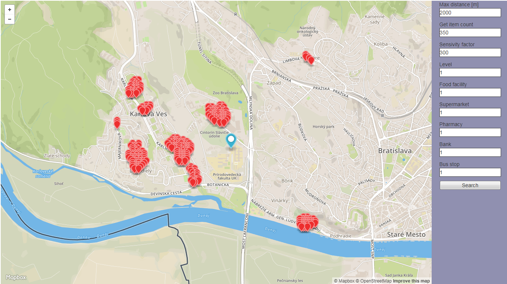
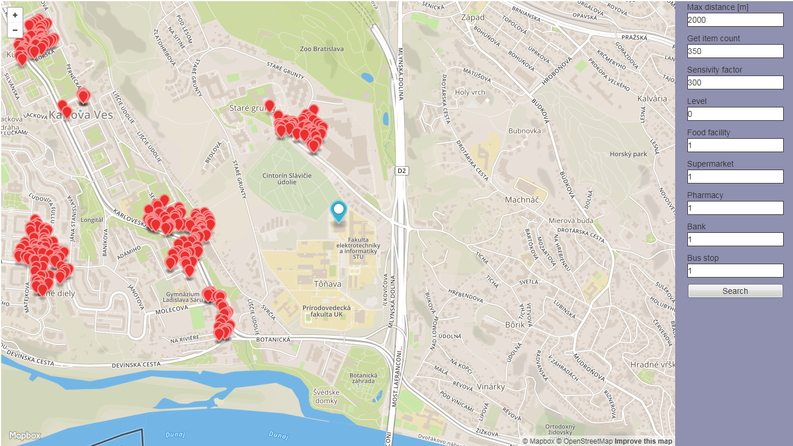
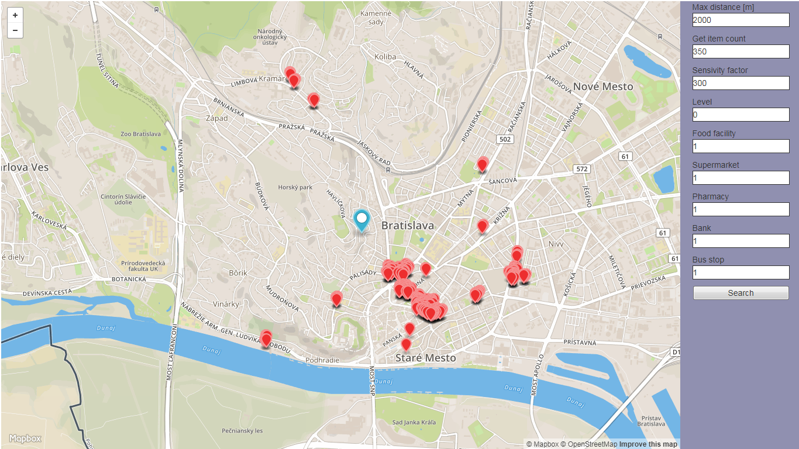
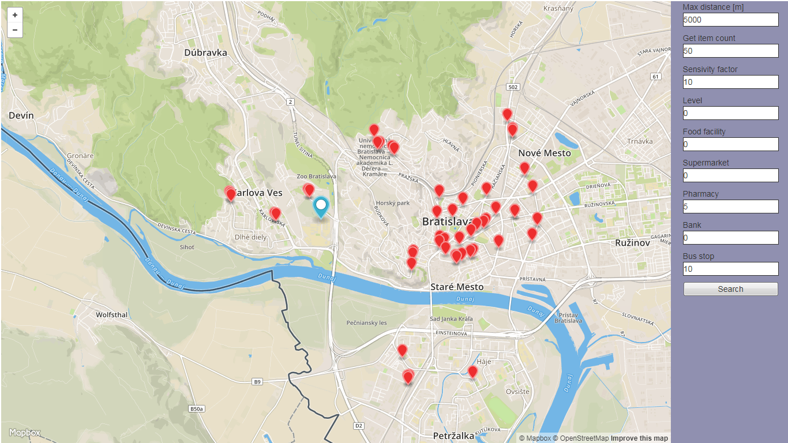
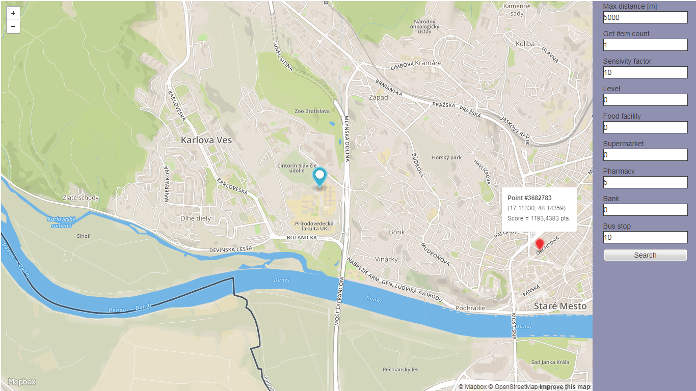

# Úvod
Táto aplikácia vyhľadáva podľa umiestnenej značky, citlivosti, typu analyzovaných bodov a váh miesta, ktoré majú najlepšie hodnotenie. Hodnotenie sa počíta na základe vzdialeností najbližších objektov zadaného typu a váh pre tieto typy. Nájdene miesta budú označené značkami.

# Dáta
V úlohe sme použili dáta dostupné na Open Street Maps (adresa https://www.openstreetmap.org/).
V práci využívame dump s dátumu 29.10.2017, ohraničený Bratislavou.

Súradnice ohraničenia mapy:
       SRID 4326           SRID 900913
min_x  16.9775515188954	   1889932.39
max_x  17.2376983251162	   1918891.80
min_y  48.0992451999721	   6123381.61
max_y  48.2250000000000    6144368.78

Tento dump sme nahrali do databázy pomocou programu osm2pgsql.
Kvôli výpočtovej náročnosti vypočítavania hodnotenia na základe 5 typov objektov, vzdialenosť do najbližšieho objektu každého typu sa nevypočítavá operatívne, ale vypočítava sa jeden raz pri príprave DB. Na to sa používajú doplňujúce stĺpce do ktorých sa výsledky aj zapisujú.
Okrem faktických bodov s mapy tam sa pridávajú aj generované cez každých 50, 100 a 200 metrov body.
Podľa intervalu generovania body majú identifikátor level: real = 0, 50m = 1, 100m = 2, 200m = 3. 
Skripty na prípravu databázy sú v súbori prepare.sql.

# Funkcie aplikácie
- vyhľadávanie miest s najlepším hodnotením
- vyhľadávanie na základe zadanej maximálnej vzdialenosti v rozsahu 0...10 km
- vyhľadávanie na základe koeficientu citlivosti                    1...3000
- vyhľadávanie na základe váh pre každý typ objektu                 -10...10
- určenie množstva nájdených bodov v rozsahu                        0 - 350
- zmena ukazovateľa aktuálnej pozície
- pre každý nájdený objekt vyskakuje popup okno s informáciou o súradniciach a hodnotení
- pre ukazovateľ sa zobrazuje popup okno s aktuálnymi súradnicami

# Fungovanie aplikácie
Aplikácia sa skladá s Backendu, ktorý je naprogramovaný v C# a webového Frontendu naprogramovaného v HTML a Javascript.
Backend poskytuje Web Service funkciu FindPoints(), ktorej návratová hodnota je geojson s dopytovaným výsledkom.
Frontend slúži na zadávanie dopytu a zobrazovanie výsledku. Na kreslenie pozadia mapy sa používa MapBox.

**Ukážka dopytu na nájdenie 350 bodov s najvyšším hodnotením v okolí 2000m podľa faktických bodov a váh 5,5,5,5,-5**

'POST WebForm1.aspx/FindPoints?latC=17.07171320915222&longC=48.153840297249474&distance=2000&count=350&level=0&sens=0&w1=5&w2=5&w3=5&w4=5&lw5=-5' 

# Ukážka aplikácie

