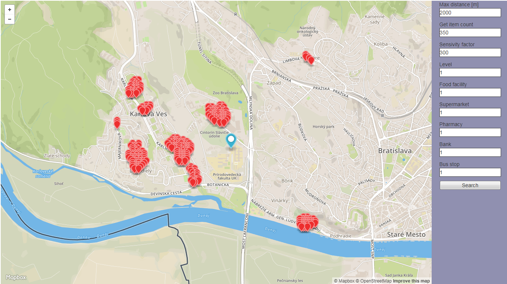
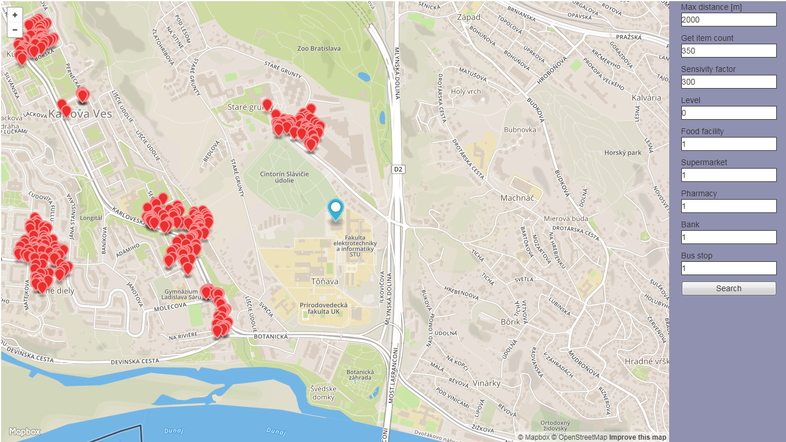
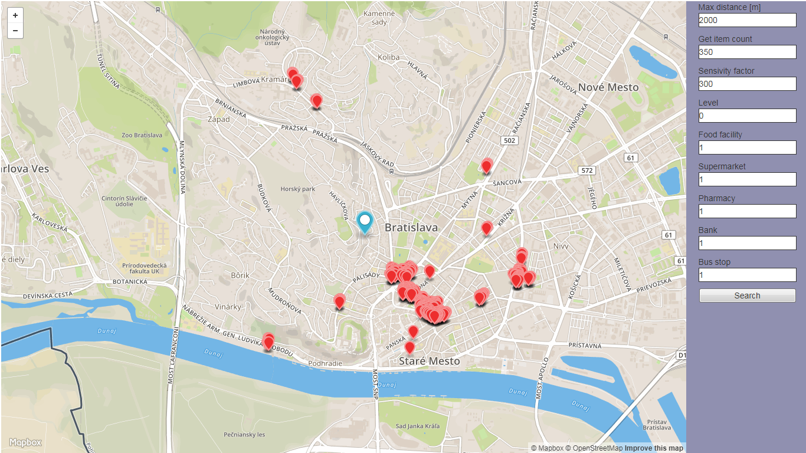
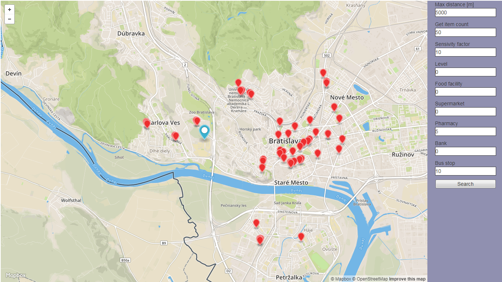
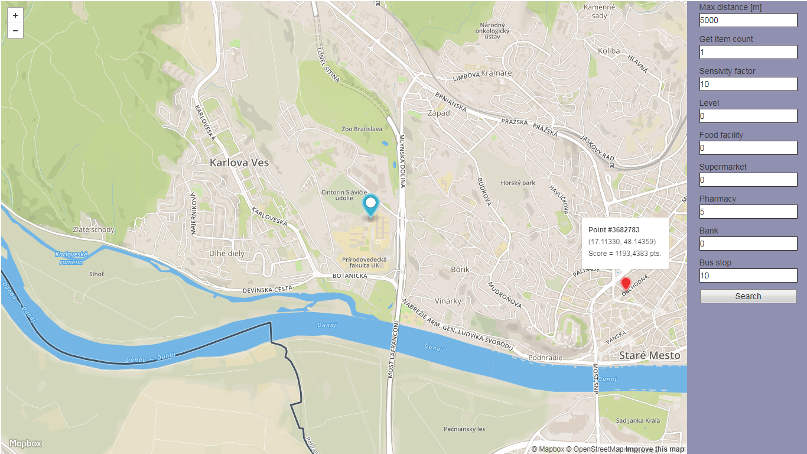

# Úvod
Táto aplikácia vyh¾adáva pod¾a umiestnenej znaèky, citlivosti, typu analyzovanıch bodov a váh miesta, ktoré majú najlepšie hodnotenie. Hodnotenie sa poèíta na základe vzdialeností najbli�ších objektov zadaného typu a váh pre tieto typy. Nájdene miesta budú oznaèené znaèkami.

# Dáta
V úlohe sme pou�ili dáta dostupné na Open Street Maps (adresa https://www.openstreetmap.org/).
V práci vyu�ívame dump s dátumu 29.10.2017, ohranièenı Bratislavou.

Súradnice ohranièenia mapy:
		SRID 4326			SRID 900913
min_x		16.9775515188954	1889932.39
max_x	17.2376983251162	1918891.80
min_y		48.0992451999721	6123381.61
max_y	48.2250000000000	6144368.78

Tento dump sme nahrali do databázy pomocou programu osm2pgsql.
Kvôli vıpoètovej nároènosti vypoèítavania hodnotenia na základe 5 typov objektov, vzdialenos� do najbli�šieho objektu ka�dého typu sa nevypoèítavá operatívne, ale vypoèítava sa jeden raz pri príprave DB. Na to sa pou�ívajú doplòujúce ståpce do ktorıch sa vısledky aj zapisujú.
Okrem faktickıch bodov s mapy tam sa pridávajú aj generované cez ka�dıch 50, 100 a 200 metrov body.
Pod¾a intervalu generovania body majú identifikátor level: real = 0, 50m = 1, 100m = 2, 200m = 3. 
Skripty na prípravu databázy sú v súbori prepare.sql.

# Funkcie aplikácie
- vyh¾adávanie miest s najlepším hodnotením
- vyh¾adávanie na základe zadanej maximálnej vzdialenosti v rozsahu 	0...10 km
- vyh¾adávanie na základe koeficientu citlivosti 					1...3000
- vyh¾adávanie na základe váh pre ka�dı typ objektu 				-10...10
- urèenie mno�stva nájdenıch bodov v rozsahu 				0 - 350
- zmena ukazovate¾a aktuálnej pozície
- pre ka�dı nájdenı objekt vyskakuje popup okno s informáciou o súradniciach a hodnotení
- pre ukazovate¾ sa zobrazuje popup okno s aktuálnymi súradnicami

# Fungovanie aplikácie
Aplikácia sa skladá s Backendu, ktorı je naprogramovanı v C# a webového Frontendu naprogramovaného v HTML a Javascript.
Backend poskytuje Web Service funkciu FindPoints(), ktorej návratová hodnota je geojson s dopytovanım vısledkom.
Frontend slú�i na zadávanie dopytu a zobrazovanie vısledku. Na kreslenie pozadia mapy sa pou�íva MapBox.

**Uká�ka dopytu na nájdenie 350 bodov s najvyšším hodnotením v okolí 2000m pod¾a faktickıch bodov a váh 5,5,5,5,-5**

'POST WebForm1.aspx/FindPoints?latC=17.07171320915222&longC=48.153840297249474&distance=2000&count=350&level=0&sens=0&w1=5&w2=5&w3=5&w4=5&lw5=-5' 

# Uká�ka aplikácie

